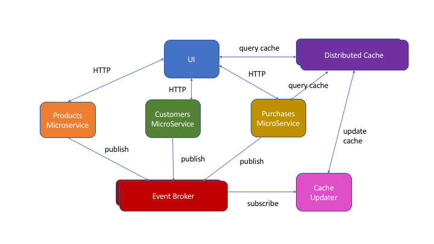

# Multidomain Architecture

## Problem Statement / Assumptions

The information to be maintained are *Customers*, *Products* and Purchases. A Product can be purchased by multiple Customers. 
A Customer can buy multiple Products. It is required to be able to manage customer purchases and we would like to have a user
interface that allows to search for information about customers (and their products) or products (and the 
customers who have purchased any of them). 

### Solution 

See the figure below:

There should be **three** different microservices (one for each main business function): 

* A **Customer Microservice** which maintains data about the customers in a company. This Microservice offers a REST API
that allows to, at least, to retrieve customer data. We assume the microservice allows to obtain customers by id and by 
filtering conditions (name, age, etc.). If a Customer is added or removed an event (with the customer id) is emitted to an event broker, so that it can be listened by other components in the architecture. I

* A **Catalog Microservice** which maintains all the data about the products that the company is offering to Customers. 
This Microservice offers a REST API that allows to, at least, to retrieve data about products. We assume this microservice allows to obtain products by id and by filtering conditions (product name, etc.). We can assume as well that this microservice maintains the stock quantities. If a new Product is added, removed or modified (for instance, stock changes) an event (including the product id) is emitted to an event broker, so that it can be listened by other components in the architecture. 

* A **Purchases Microservice** which allows to purchase a Product by a Customer. This microservice
will expose at least one operation `purchase(customer_id, product_id, quantity)`. In order to validate customer_ids and product_ids this Microservice can use data present in the Distributed Cache (see below). An event can be emitted when a new purchase is done, so that the rest of components can keep up to date their information about who has bought what.  

In addition there should be four additional extra infrastructure components (not belonging to any of the above domains) that bring support to the solution: 

* **Event Broker** a publish/subscribe broker that allows asynchronous communication of events emitted by microservices in a decoupled fashion. 

* **Distributed Cache** A bridge table that associate products and customers (which are in the bridge between domains) can be stored in a distributed cache (e.g. Apache Ignite), that will be kept up to date by a "Cache Updater" component (see below). Such cache should contain the list of valid product ids, the list of valid customer ids, and an associative table or bridge table linking customer ids and product ids.

* **Cache Updater** This component listens to events emitted by the different microservices and updates the distributed cache accordingly. Avoids the coupling between microservices, as microservices, in general will only have to worry about emitting their own events, without knowing the existence of a cache, or even other microservices. 

* **UI Component**. This component can be a servlet or similar which is capable to deliver the proper content or data to the Web Browser which renders the UI. 

### Scenarios

**Scenario 1**: Search for all customers (or only those matching a filter) including information about the products they have bought. The *Controller UI front-end component* in charge of resolving this request will perform the following steps:

1. Issue a request to the Customer MicroService by querying data through the REST API including an empty filter. The Customer Microservice will execute a query that will allow to obtain the information of each matching customer. This query may result in a huge number of pages, and the assumption is that the service offers pagination mechanisms, so that in each interaction only a subset of the customers is retrieved. 

2. Launch a query against the Ditributed Cache to obtain the list products which have been bought by each customer present in the initial query result (that will be done for each page initially obtained). 

3. With the information provided by the cache, issue a request to the Product Microservice by asking for the information of the products purchased by each customer present in the current page. 

**Scenario 2**: Search for all products including information about the customers that have purchased those products. The *Controller front-end component* in charge of resolving this request will perform the following steps:

1. Issue a request to the the Product MicroService by querying data through the REST API including an empty filter. The Product MicroService will execute a query that will allow to obtain the information of each matching product. This query may result in a huge number of pages, and the assumption is that the service offers pagination mechanisms, so that in each interaction only a subset of the products is retrieved. 

2. Launch a query against the Ditributed Cache to obtain the list customers which have purchased each product in the initial query result (that will be done for each page initially obtained). 

3. With the information provided by the cache, issue a request to the Customer MicroService by asking for the information of the customer who purchased each product in the current page.

